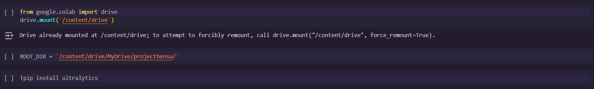
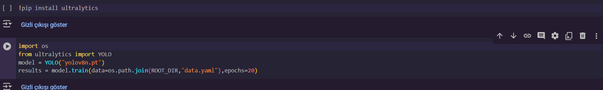
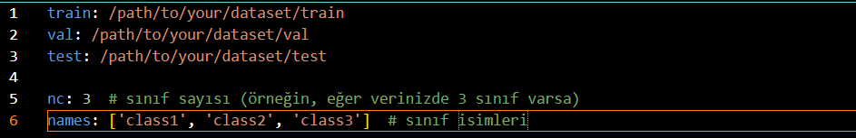
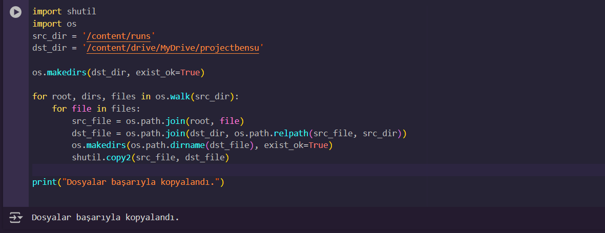
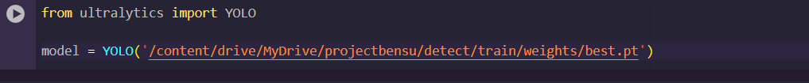
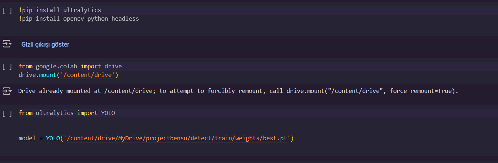
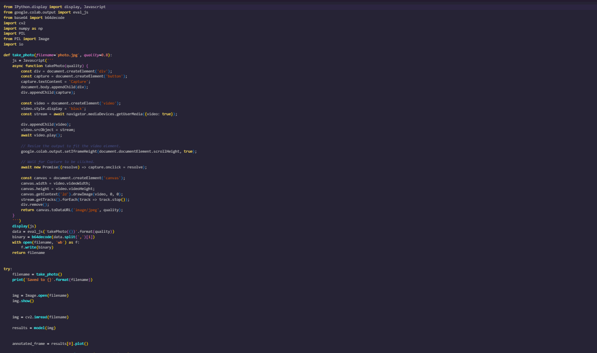

# Armed-unarmed-person-detection-with-YOLOv8n
Roboflow platformundan almış olduğum hazır veri seti ile YOLOv8 modelini kullanarak webcamden alınan görüntü üzerinde silahlı ve silahsız insan tespiti yaptım. 

(I used a pre-made dataset from the Roboflow platform and the YOLOv8 model to detect armed and unarmed individuals in real-time using a webcam.)

1. Mount Google Drive and define root directory which contains the path of the project in Google Drive. The arrangement may need to be adjusted according to the path of your own project.

2. Install ultralytics and load pre-trained model. You can choose your model version according to your needs, I preferred the YOLOv8n model because of its speed then train the model.

You need to configure your YAML file according to the paths of the training, test, and validation data in your project. For example;

3. We are saving all files related to the trained model to Google Drive."
   
   
4.Within these files, the file named best.pt is the model file trained with our data

5. We import the YOLO class from the ultralytics library and load a pre-trained YOLO model from the specified weights file, 'best.pt'.

6.In this project, I detected whether individuals in webcam footage were armed or not. You can detect using your own dataset from a camera, video, or an image. I wrote the code on Google Drive and used a ready-made JavaScript code to access the camera.

